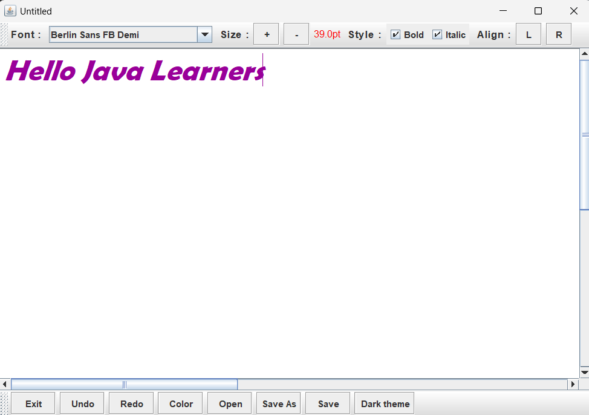
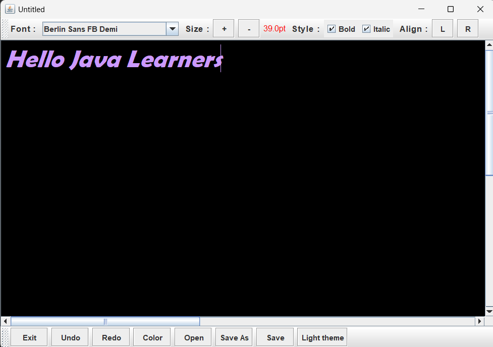
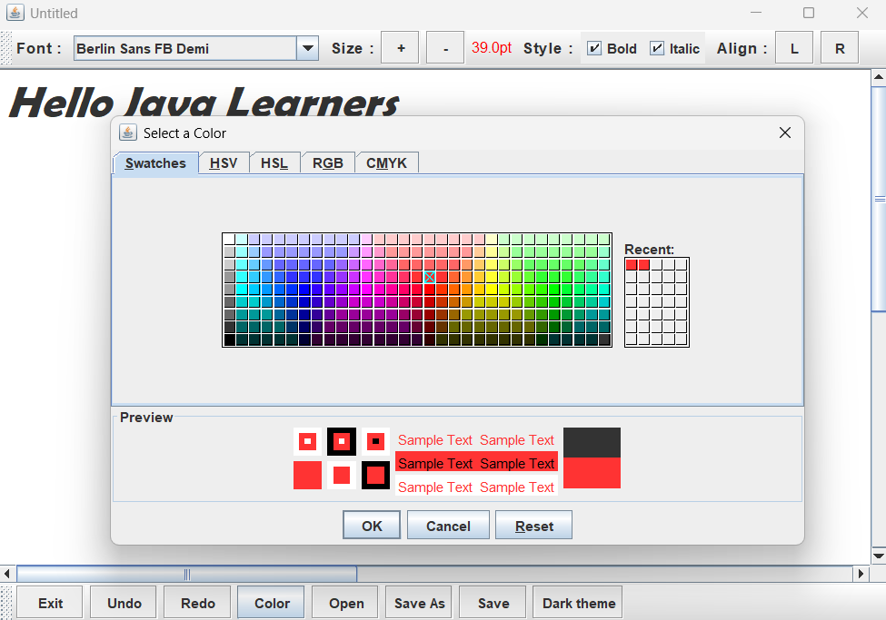
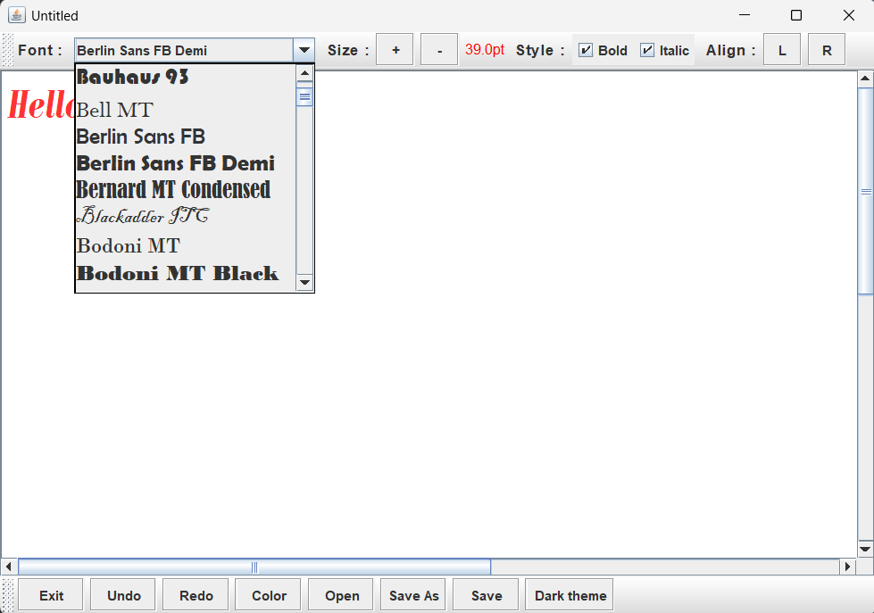
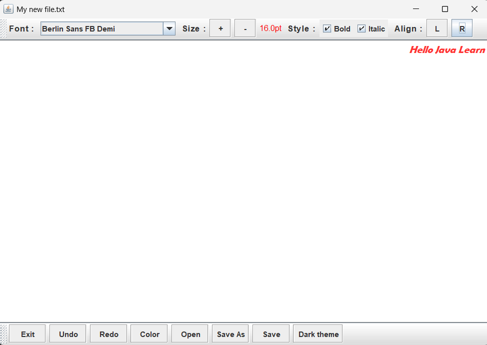
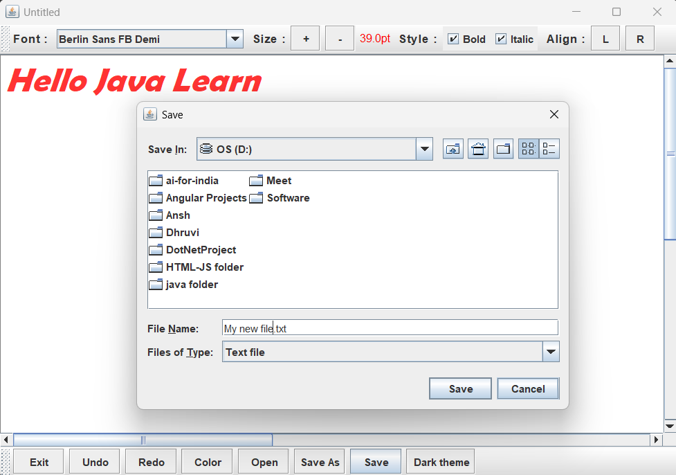
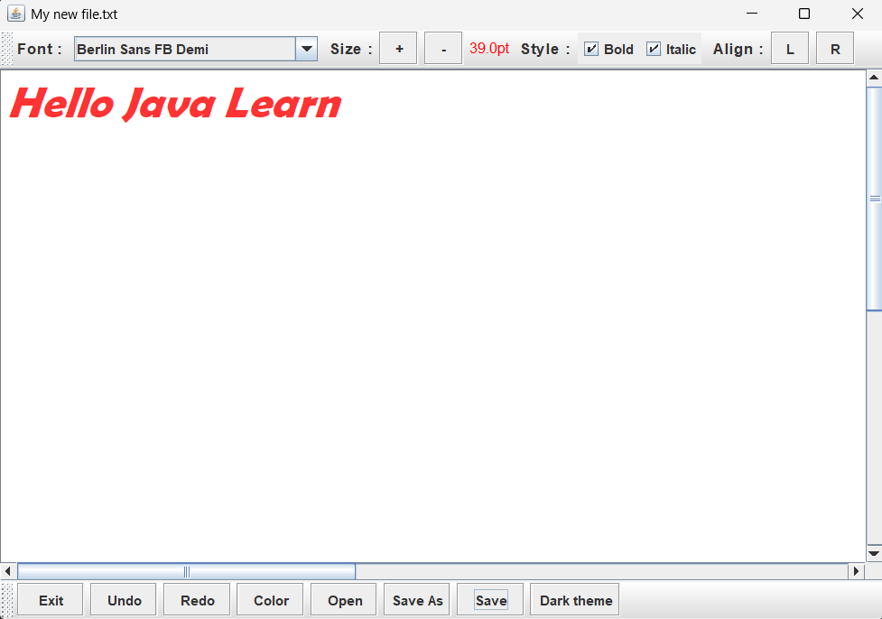

# Java Text Editor with Undo/Redo Functionality

This is a simple yet feature-rich text editor developed using Java Swing. It includes core functionalities like text editing, saving/loading files, font customization, and manual undo/redo support.

## 🛠 Features

- **Undo/Redo** using custom Stack implementation
- **Open**, **Save**, and **Save As** file operations
- Font customization:
  - Font family
  - Font size
  - Bold / Italic styles
- **Text Alignment**: Left-to-Right or Right-to-Left
- **Color Picker** for text color
- **Dark/Light Theme** switcher
- Keyboard shortcuts:
  - `Ctrl + Z`: Undo
  - `Ctrl + Y`: Redo
  - `Ctrl + B`: Toggle Bold
  - `Ctrl + I`: Toggle Italic
  - `Ctrl + L`: Align Left
  - `Ctrl + R`: Align Right
  - `Ctrl + W`: Exit Application

  
  
  
  
  
  
  
  

## ▶️ Getting Started

### Prerequisites

- JDK 8 or higher
- Any Java IDE (Eclipse, IntelliJ, NetBeans) or a terminal

### Run Instructions

```bash
javac undo_redo.java FocusSetter.java
java undo_redo
```

## 💡 How Undo/Redo Works

Instead of using Swing’s built-in `UndoManager`, this project maintains two `Stack<String>` structures:

- **Undo**: Stores text changes
- **Redo**: Restores undone changes

### Example Logic

- When typing: new content is pushed to the **Undo** stack.
- On `Ctrl + Z` or clicking **Undo**:
  - Top of the **Undo** stack is moved to **Redo**.
  - Text area resets to the previous state (`texts` + last undo state).
- On `Ctrl + Y` or clicking **Redo**:
  - Top of the **Redo** stack is moved back to **Undo**.
  - Text area reflects the redone change.

---

## ⚠️ Limitations

- Undo/Redo works on **full text segments**, not individual characters.
- Only supports `.txt` files (no rich-text or other formats).
- Font, color, and theme settings are not saved with files.
- Basic error handling (e.g., file read/write failures).

---

## 📌 Author

- Developed by: **Dhruvi Khanpara**
